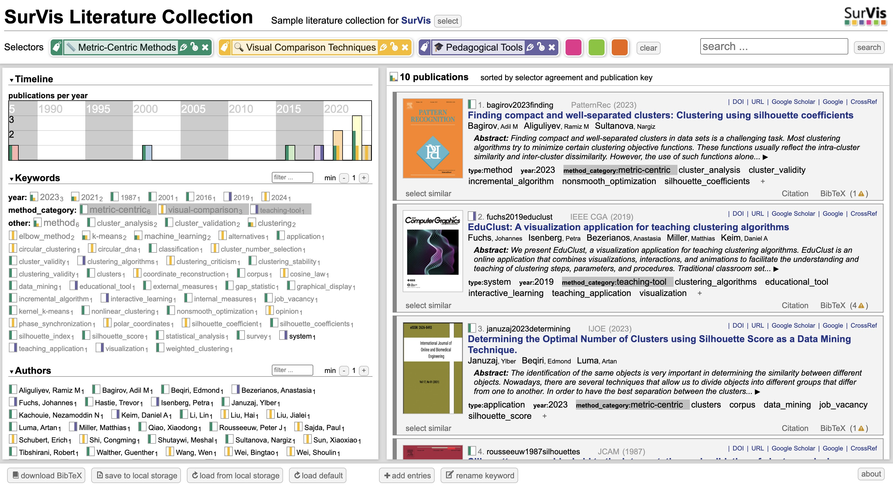

# SurVis - Clustering Evaluation Methods Literature Browser



This is an interactive visual literature browser powered by **SurVis** to support my COMP4037 Coursework 3 (Research Methods) at the University of Nottingham.  
The topic of this review is **"Methods for Selecting the Number of Clusters (k) in Clustering"**, with a particular focus on **visual evaluation metrics**, such as **silhouette score**, **elbow method**, and **gap statistic**.

📚 The goal of this SurVis interface is to:

- Organize and categorize 10 academic research papers related to k selection in clustering
- Enable easy browsing, filtering, and analysis of evaluation strategies
- Complement my 2000-word abridged literature review submission

## How to Use

To launch SurVis locally:

1. Clone this repository or download the ZIP
2. Make sure your BibTeX entries are saved to `bib/references.bib`
3. Open `src/index.html` in your browser
4. Run the following to process your `.bib` file:

```bash
python update_data.py
```
